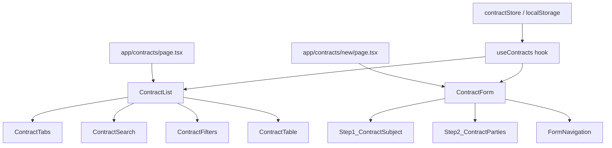
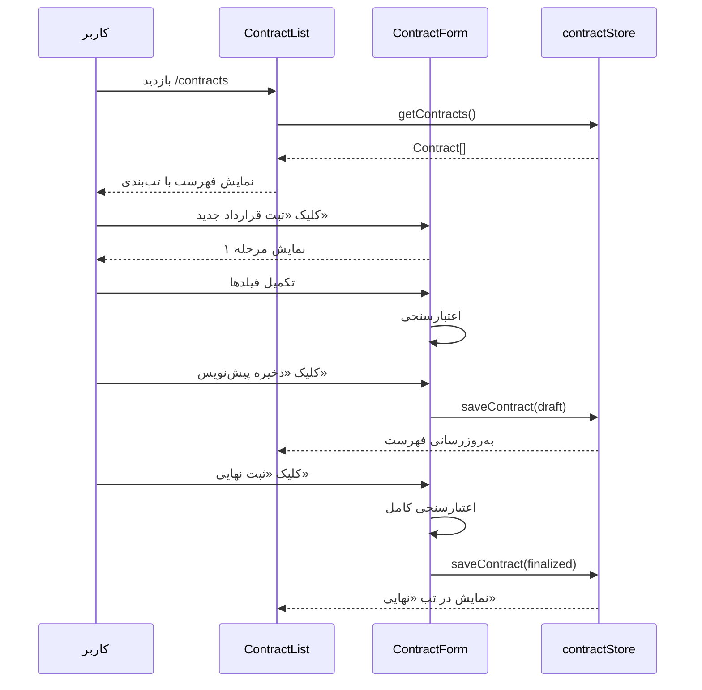

# مستند طراحی: سامانه مدیریت قراردادهای واحدهای ساختمانی (contract-list)

## خلاصه

این سامانه یک ماژول فرانت‌اند برای ثبت، مشاهده و مدیریت قراردادهای فروش و پیش‌فروش واحدهای ساختمانی است. شامل دو بخش اصلی است: صفحه فهرست قراردادها (`/contracts`) با قابلیت تب‌بندی، جستجو و فیلتر، و صفحه فرم چندمرحله‌ای ثبت قرارداد (`/contracts/new`). این ماژول کاملاً با استانداردهای RTL فارسی، فونت ایران و سیستم طراحی موجود اپلیکیشن هماهنگ است.

---

## معماری

### ساختار کلی



### جریان داده



---

## کامپوننت‌ها و رابط‌ها

### کامپوننت‌های صفحه فهرست

#### `ContractList`
کامپوننت اصلی صفحه `/contracts`. مدیریت state تب فعال، فیلترها و جستجو را بر عهده دارد.

```typescript
interface ContractListProps {
  initialContracts?: Contract[];
}
```

#### `ContractTabs`
نمایش دو تب «قراردادهای نهایی» و «پیش‌نویس‌ها» با شمارنده.

```typescript
interface ContractTabsProps {
  activeTab: ContractStatus;
  finalizedCount: number;
  draftCount: number;
  onTabChange: (tab: ContractStatus) => void;
}
```

#### `ContractSearch`
فیلد جستجوی متنی با debounce 300ms.

```typescript
interface ContractSearchProps {
  value: string;
  onChange: (value: string) => void;
}
```

#### `ContractFilters`
فیلترهای نوع قرارداد، بازه تاریخ، بلوک و واحد.

```typescript
interface ContractFiltersProps {
  filters: FilterState;
  blocks: Block[];
  units: Unit[];
  onFilterChange: (filters: FilterState) => void;
  onClearFilters: () => void;
}
```

#### `ContractTable`
جدول نمایش قراردادها با ستون‌های: شماره، نوع، واحد، طرفین، تاریخ، وضعیت، عملیات.

```typescript
interface ContractTableProps {
  contracts: Contract[];
  onEdit: (id: string) => void;
}
```

### کامپوننت‌های فرم ثبت قرارداد

#### `ContractForm`
کامپوننت اصلی فرم چندمرحله‌ای. مدیریت state کل فرم و ناوبری بین مراحل.

```typescript
interface ContractFormProps {
  initialData?: Partial<ContractFormData>;
  contractId?: string; // برای ویرایش پیش‌نویس
}
```

#### `Step1_ContractSubject`
مرحله اول: موضوع قرارداد (منعقدکننده، نوع، تاریخ، شماره، بلوک، واحد).

```typescript
interface Step1Props {
  data: ContractSubjectData;
  employees: Employee[];
  blocks: Block[];
  units: Unit[];
  onChange: (data: ContractSubjectData) => void;
  onValidate: () => boolean;
}
```

#### `Step2_ContractParties`
مرحله دوم: طرفین قرارداد و سهم‌بندی.

```typescript
interface Step2Props {
  data: ContractPartiesData;
  partners: Partner[];
  buyers: Buyer[];
  onChange: (data: ContractPartiesData) => void;
  onValidate: () => boolean;
}
```

#### `ShareInput`
کامپوننت ورودی سهم با دو حالت درصد/دانگ.

```typescript
interface ShareInputProps {
  value: Share;
  onChange: (share: Share) => void;
  mode: 'percent' | 'dang';
  onModeChange: (mode: 'percent' | 'dang') => void;
}
```

#### `FormNavigation`
دکمه‌های ناوبری فرم: «قبلی»، «بعدی»، «ذخیره پیش‌نویس»، «ثبت نهایی».

```typescript
interface FormNavigationProps {
  currentStep: number;
  totalSteps: number;
  onPrev: () => void;
  onNext: () => void;
  onSaveDraft: () => void;
  onFinalize: () => void;
}
```

### Custom Hook

#### `useContracts`
مدیریت state قراردادها، فیلترها و عملیات CRUD.

```typescript
interface UseContractsReturn {
  contracts: Contract[];
  filteredContracts: Contract[];
  filters: FilterState;
  searchQuery: string;
  activeTab: ContractStatus;
  setActiveTab: (tab: ContractStatus) => void;
  setSearchQuery: (q: string) => void;
  setFilters: (f: FilterState) => void;
  clearFilters: () => void;
  saveContract: (data: ContractFormData, status: ContractStatus) => void;
  getContractById: (id: string) => Contract | undefined;
}
```

---

## مدل‌های داده

```typescript
// وضعیت قرارداد
type ContractStatus = 'finalized' | 'draft';

// نوع قرارداد
type ContractType = 'sale' | 'pre-sale';

// نوع منعقدکننده
type ContractorType = 'self' | 'employee' | 'former-employee';

// حالت سهم‌بندی
type ShareMode = 'percent' | 'dang';

// نوع شخص
type PersonType = 'natural' | 'legal';

// سهم
interface Share {
  value: number;
  mode: ShareMode;
}

// منعقدکننده قرارداد
interface Contractor {
  type: ContractorType;
  employeeId?: string;       // برای نوع 'employee'
  formerFirstName?: string;  // برای نوع 'former-employee'
  formerLastName?: string;   // برای نوع 'former-employee'
}

// طرف قرارداد (یک نفر)
interface ContractParty {
  personId: string;
  personType: PersonType;
  name: string;
  share: Share;
}

// داده‌های مرحله اول فرم
interface ContractSubjectData {
  contractor: Contractor;
  contractType: ContractType;
  contractDate: string;       // تاریخ شمسی به فرمت YYYY/MM/DD
  contractNumber: string;
  deliveryDate: string;       // تاریخ شمسی
  blockId: string;
  unitId: string;
}

// داده‌های مرحله دوم فرم
interface ContractPartiesData {
  partyOne: ContractParty[];  // طرف اول (صاحب کسب‌وکار یا شرکا)
  partyTwo: ContractParty[];  // طرف دوم (خریداران)
}

// داده کامل فرم قرارداد
interface ContractFormData {
  subject: ContractSubjectData;
  parties: ContractPartiesData;
}

// موجودیت قرارداد ذخیره‌شده
interface Contract {
  id: string;
  status: ContractStatus;
  createdAt: string;
  updatedAt: string;
  data: ContractFormData;
}

// وضعیت فیلترها
interface FilterState {
  contractType: ContractType | null;
  dateFrom: string | null;
  dateTo: string | null;
  blockId: string | null;
  unitId: string | null;
}

// موجودیت‌های مرجع
interface Block {
  id: string;
  name: string;
}

interface Unit {
  id: string;
  blockId: string;
  name: string;
}

interface Employee {
  id: string;
  firstName: string;
  lastName: string;
}

interface Partner {
  id: string;
  name: string;
  personType: PersonType;
}

interface Buyer {
  id: string;
  name: string;
  personType: PersonType;
}
```

---

## ساختار فایل‌ها

```
app/
  contracts/
    page.tsx                          ← صفحه فهرست قراردادها
    new/
      page.tsx                        ← صفحه فرم ثبت قرارداد
  components/
    contracts/
      ContractList.tsx
      ContractTabs.tsx
      ContractSearch.tsx
      ContractFilters.tsx
      ContractTable.tsx
      ContractForm.tsx
      Step1_ContractSubject.tsx
      Step2_ContractParties.tsx
      ShareInput.tsx
      FormNavigation.tsx
  hooks/
    useContracts.ts
  lib/
    contractStore.ts                  ← ذخیره‌سازی در localStorage
    contractValidation.ts             ← توابع اعتبارسنجی
```

---

## تصمیمات طراحی

1. **ذخیره‌سازی localStorage**: در غیاب backend، قراردادها در localStorage ذخیره می‌شوند. این رویکرد با الگوی موجود در اپلیکیشن (ProfileForm) هماهنگ است.

2. **فرم چندمرحله‌ای ۲ مرحله‌ای**: به جای یک فرم بلند، دو مرحله مجزا برای بهبود UX انتخاب شد. مرحله ۱ موضوع قرارداد، مرحله ۲ طرفین.

3. **debounce جستجو**: برای رعایت نیازمندی ۲.۲ (به‌روزرسانی در کمتر از ۳۰۰ms)، از debounce با تأخیر ۲۵۰ms استفاده می‌شود.

4. **سهم‌بندی دانگ**: مقدار دانگ به صورت عدد اعشاری ذخیره می‌شود (مثلاً ۳ دانگ = ۳) و در نمایش به صورت «۳ از ۶ دانگ» نشان داده می‌شود.

5. **اعتبارسنجی مرحله‌ای**: هر مرحله از فرم قبل از رفتن به مرحله بعد اعتبارسنجی می‌شود، اما ذخیره پیش‌نویس بدون اعتبارسنجی کامل امکان‌پذیر است.


---

## ویژگی‌های صحت (Correctness Properties)

*یک property ویژگی یا رفتاری است که باید در تمام اجراهای معتبر سیستم صادق باشد - به عبارتی، یک گزاره رسمی درباره آنچه سیستم باید انجام دهد. Properties پلی هستند بین مشخصات قابل‌خواندن توسط انسان و تضمین‌های صحت قابل‌تأیید توسط ماشین.*

### Property 1: فیلتر تب فقط قراردادهای با وضعیت مطابق را نشان می‌دهد

*برای هر* مجموعه‌ای از قراردادها با وضعیت‌های مختلف، وقتی تب «نهایی» فعال است تمام قراردادهای نمایش‌داده‌شده باید وضعیت `finalized` داشته باشند، و وقتی تب «پیش‌نویس» فعال است تمام قراردادهای نمایش‌داده‌شده باید وضعیت `draft` داشته باشند.

**Validates: Requirements 1.2, 1.3**

---

### Property 2: شمارنده تب با تعداد واقعی قراردادها برابر است

*برای هر* مجموعه‌ای از قراردادها، عدد نمایش‌داده‌شده در کنار هر تب باید دقیقاً برابر با تعداد قراردادهایی باشد که وضعیت مطابق با آن تب دارند.

**Validates: Requirements 1.4**

---

### Property 3: جستجو فقط قراردادهای مرتبط را برمی‌گرداند

*برای هر* مجموعه‌ای از قراردادها و هر رشته جستجو، تمام قراردادهای نمایش‌داده‌شده باید حداقل یکی از این شرایط را داشته باشند: رشته جستجو در شماره قرارداد، نام طرفین یا نام واحد آن‌ها وجود داشته باشد.

**Validates: Requirements 2.1**

---

### Property 4: ترکیب فیلترها فقط قراردادهای برآورنده تمام شرایط را نشان می‌دهد

*برای هر* مجموعه‌ای از قراردادها و هر ترکیبی از فیلترها (نوع قرارداد، بازه تاریخ، بلوک، واحد)، تمام قراردادهای نمایش‌داده‌شده باید تمام فیلترهای فعال را برآورده کنند.

**Validates: Requirements 2.3, 2.4, 2.5, 2.6**

---

### Property 5: پاک کردن فیلترها به حالت اولیه برمی‌گردد

*برای هر* مجموعه‌ای از قراردادها، اعمال هر ترکیبی از فیلترها و سپس پاک کردن آن‌ها باید نتیجه‌ای یکسان با حالت بدون فیلتر برگرداند.

**Validates: Requirements 2.7**

---

### Property 6: انتخاب نوع منعقدکننده، فیلدهای مناسب را نمایش می‌دهد

*برای هر* انتخاب نوع منعقدکننده، فیلدهای نمایش‌داده‌شده باید دقیقاً با آن نوع مطابقت داشته باشند: «سایر کارمندان» → dropdown کارمندان، «کارمند سابق» → دو فیلد نام و نام خانوادگی، «خودم» → هیچ فیلد اضافه‌ای.

**Validates: Requirements 3.2, 3.3**

---

### Property 7: واحدهای نمایش‌داده‌شده متعلق به بلوک انتخاب‌شده هستند

*برای هر* بلوک انتخاب‌شده، تمام واحدهای نمایش‌داده‌شده در dropdown واحد باید `blockId` برابر با آن بلوک داشته باشند.

**Validates: Requirements 3.9**

---

### Property 8: اعتبارسنجی فیلدهای الزامی خطای مشخص برمی‌گرداند

*برای هر* ترکیبی از داده‌های فرم که حداقل یک فیلد الزامی خالی داشته باشد، تابع اعتبارسنجی باید برای هر فیلد خالی یک پیام خطای مشخص برگرداند و اجازه پیشروی ندهد.

**Validates: Requirements 3.11, 5.7**

---

### Property 9: مجموع سهم‌ها نباید از حد مجاز تجاوز کند

*برای هر* مجموعه‌ای از سهم‌های طرفین قرارداد، اگر مجموع سهم‌های درصدی از ۱۰۰ تجاوز کند یا مجموع سهم‌های دانگی از ۶ تجاوز کند، اعتبارسنجی باید خطا برگرداند.

**Validates: Requirements 4.8, 4.9, 4.10, 4.11**

---

### Property 10: وضعیت ذخیره‌شده با نوع ذخیره‌سازی مطابقت دارد

*برای هر* داده فرمی، ذخیره به عنوان پیش‌نویس باید وضعیت `draft` ذخیره کند (حتی با داده ناقص)، و ثبت نهایی با داده کامل باید وضعیت `finalized` ذخیره کند.

**Validates: Requirements 5.2, 5.6**

---

### Property 11: بارگذاری پیش‌نویس داده‌های ذخیره‌شده را بازمی‌گرداند (Round-trip)

*برای هر* داده فرمی، ذخیره به عنوان پیش‌نویس و سپس بارگذاری مجدد آن باید دقیقاً همان داده‌های اولیه را برگرداند.

**Validates: Requirements 5.4**

---

## مدیریت خطا

### خطاهای اعتبارسنجی فرم

| خطا | شرط | پیام |
|-----|-----|------|
| فیلد الزامی خالی | هر فیلد required که مقدار ندارد | «این فیلد الزامی است» |
| بلوک انتخاب نشده | تلاش برای انتخاب واحد بدون بلوک | «ابتدا یک بلوک انتخاب کنید» |
| تجاوز سهم درصدی | مجموع سهم‌ها > 100 | «مجموع سهم‌ها نباید از ۱۰۰٪ تجاوز کند» |
| تجاوز سهم دانگی | مجموع سهم‌ها > 6 | «مجموع سهم‌ها نباید از ۶ دانگ تجاوز کند» |

### خطاهای ذخیره‌سازی

- اگر localStorage در دسترس نباشد، خطا به کاربر نمایش داده می‌شود
- اگر داده‌های ذخیره‌شده corrupt باشند، با مقادیر پیش‌فرض جایگزین می‌شوند

### حالت‌های خالی

- فهرست قراردادهای خالی: پیام «قراردادی یافت نشد» با آیکون مناسب
- نتیجه جستجوی خالی: پیام «نتیجه‌ای برای جستجوی شما یافت نشد»
- فهرست کارمندان/شرکا/خریداران خالی: پیام مناسب در dropdown

---

## استراتژی تست

### رویکرد دوگانه

این ماژول از دو نوع تست مکمل استفاده می‌کند:

- **تست‌های واحد (Unit Tests)**: مثال‌های مشخص، edge caseها و شرایط خطا
- **تست‌های property-based**: ویژگی‌های کلی که برای تمام ورودی‌های معتبر باید صادق باشند

### کتابخانه تست

- **Framework**: Jest + React Testing Library
- **Property-Based Testing**: `fast-check` (کتابخانه property-based testing برای TypeScript/JavaScript)
- **حداقل تکرار**: هر تست property-based باید حداقل ۱۰۰ بار اجرا شود

### تست‌های واحد

```typescript
// مثال‌های مشخص
describe('ContractList', () => {
  it('دو تب نمایش می‌دهد', () => { ... });
  it('پیام خالی بودن را نمایش می‌دهد', () => { ... }); // edge case 1.5
  it('پیام خطا برای بلوک انتخاب‌نشده نمایش می‌دهد', () => { ... }); // edge case 3.10
  it('فیلد سهم دو حالت درصد و دانگ دارد', () => { ... }); // example 4.3
});
```

### تست‌های Property-Based

هر تست property-based باید با یک کامنت به property مربوطه در این مستند ارجاع دهد:

```typescript
// Feature: contract-list, Property 1: فیلتر تب فقط قراردادهای با وضعیت مطابق را نشان می‌دهد
it('property: tab filter', () => {
  fc.assert(fc.property(
    fc.array(arbitraryContract()),
    fc.constantFrom('finalized', 'draft'),
    (contracts, activeTab) => {
      const result = filterByTab(contracts, activeTab);
      return result.every(c => c.status === activeTab);
    }
  ), { numRuns: 100 });
});

// Feature: contract-list, Property 2: شمارنده تب با تعداد واقعی قراردادها برابر است
// Feature: contract-list, Property 3: جستجو فقط قراردادهای مرتبط را برمی‌گرداند
// Feature: contract-list, Property 4: ترکیب فیلترها فقط قراردادهای برآورنده تمام شرایط را نشان می‌دهد
// Feature: contract-list, Property 5: پاک کردن فیلترها به حالت اولیه برمی‌گردد
// Feature: contract-list, Property 6: انتخاب نوع منعقدکننده، فیلدهای مناسب را نمایش می‌دهد
// Feature: contract-list, Property 7: واحدهای نمایش‌داده‌شده متعلق به بلوک انتخاب‌شده هستند
// Feature: contract-list, Property 8: اعتبارسنجی فیلدهای الزامی خطای مشخص برمی‌گرداند
// Feature: contract-list, Property 9: مجموع سهم‌ها نباید از حد مجاز تجاوز کند
// Feature: contract-list, Property 10: وضعیت ذخیره‌شده با نوع ذخیره‌سازی مطابقت دارد
// Feature: contract-list, Property 11: بارگذاری پیش‌نویس داده‌های ذخیره‌شده را بازمی‌گرداند
```

### پوشش تست

| لایه | نوع تست | هدف |
|------|---------|-----|
| `contractValidation.ts` | Property + Unit | Properties 8، 9 |
| `contractStore.ts` | Property + Unit | Properties 10، 11 |
| `useContracts.ts` | Property + Unit | Properties 1، 2، 3، 4، 5 |
| `Step1_ContractSubject` | Property + Unit | Properties 6، 7 |
| `Step2_ContractParties` | Property + Unit | Property 9 |
