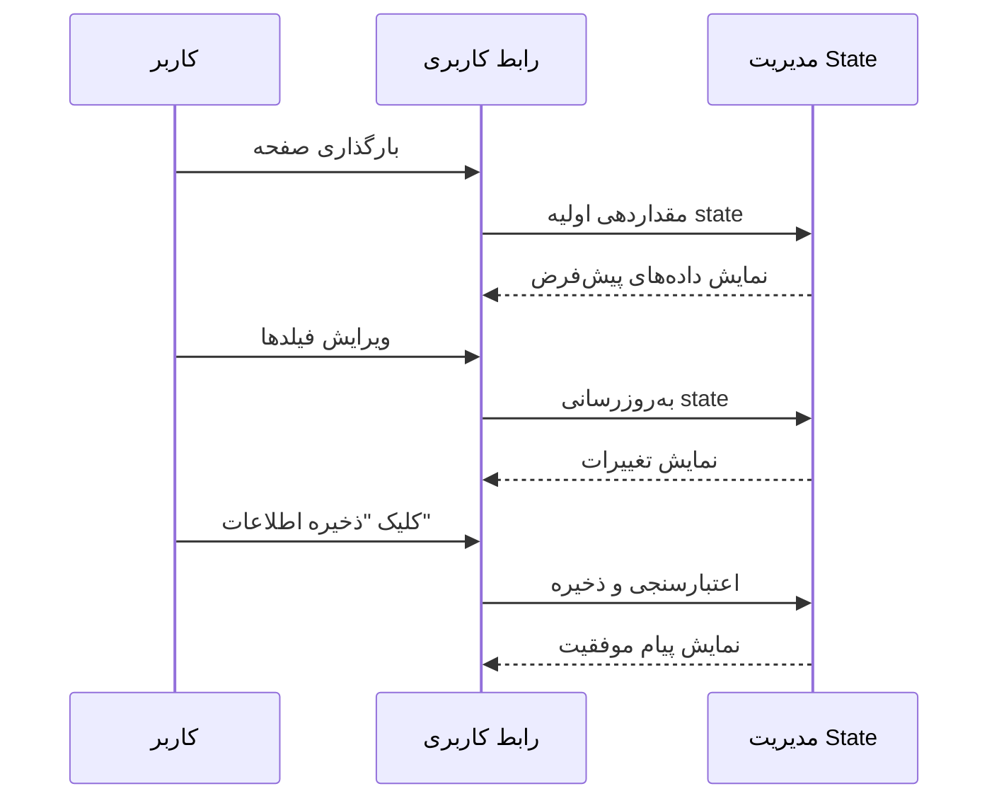

# مستند طراحی: اپلیکیشن پروفایل کاربری فارسی با راست‌چینی کامل

## خلاصه

اپلیکیشن پروفایل کاربری فارسی یک رابط کاربری فرانت‌اند با راست‌چینی کامل (RTL) است که به کاربران امکان مدیریت اطلاعات پروفایل خود را می‌دهد. این اپلیکیشن شامل هدر، سایدبار راست، فرم پروفایل با فیلدهای مختلف (تگ‌ها، رادیو باتن‌ها، چک‌باکس‌ها) و پنل اطلاعات پایین است.

## گردش کار اصلی



## رابط‌ها و انواع داده اصلی

```typescript
// انواع داده برای پروفایل کاربر
interface UserProfile {
  username: string;
  avatar: string | null;
  roles: string[];
  status: string[];
  complexUserType: ComplexUserType[];
  ownershipType: OwnershipType;
  buildingTypes: BuildingType[];
  additionalNotes: string;
}

type ComplexUserType = 'tenant' | 'rental' | 'owner' | 'visitor';
type OwnershipType = 'owner' | 'endowment' | 'lease';
type BuildingType = 'residential' | 'commercial' | 'office' | 'warehouse';

// Props برای کامپوننت‌های اصلی
interface ProfilePageProps {
  initialData?: Partial<UserProfile>;
}

interface HeaderProps {
  username: string;
  avatar: string | null;
}

interface SidebarProps {
  activeItem: string;
  onItemClick: (item: string) => void;
}

interface ProfileFormProps {
  profile: UserProfile;
  onProfileChange: (profile: UserProfile) => void;
  onSave: () => void;
}
```

## توابع کلیدی با مشخصات رسمی

### تابع 1: handleTagRemove()

```typescript
function handleTagRemove(
  field: 'roles' | 'status',
  tagToRemove: string,
  profile: UserProfile
): UserProfile
```

**پیش‌شرط‌ها:**
- `profile` نباید null باشد
- `field` باید یکی از 'roles' یا 'status' باشد
- `tagToRemove` باید رشته غیر خالی باشد

**پس‌شرط‌ها:**
- پروفایل جدید برگردانده می‌شود
- تگ مشخص شده از آرایه حذف شده است
- سایر فیلدها دست نخورده باقی می‌مانند
- هیچ تاثیری روی پروفایل ورودی ندارد (immutable)

**Loop Invariants:** N/A

### تابع 2: handleComplexUserTypeToggle()

```typescript
function handleComplexUserTypeToggle(
  type: ComplexUserType,
  profile: UserProfile
): UserProfile
```

**پیش‌شرط‌ها:**
- `profile` نباید null باشد
- `type` باید یکی از مقادیر معتبر ComplexUserType باشد

**پس‌شرط‌ها:**
- اگر `type` در آرایه وجود داشت، حذف می‌شود
- اگر `type` در آرایه نبود، اضافه می‌شود
- پروفایل جدید برگردانده می‌شود (immutable)
- سایر فیلدها دست نخورده باقی می‌مانند

**Loop Invariants:** N/A

### تابع 3: validateProfile()

```typescript
function validateProfile(profile: UserProfile): boolean
```

**پیش‌شرط‌ها:**
- `profile` نباید null یا undefined باشد

**پس‌شرط‌ها:**
- true برمی‌گرداند اگر تمام فیلدهای الزامی معتبر باشند
- false برمی‌گرداند در غیر این صورت
- هیچ تاثیری روی پروفایل ورودی ندارد

**Loop Invariants:**
- در حلقه بررسی فیلدها: تمام فیلدهای قبلی بررسی شده معتبر بوده‌اند

## شبه‌کد الگوریتمی

### الگوریتم اصلی: مدیریت State پروفایل

```typescript
// الگوریتم مدیریت state با React hooks
ALGORITHM manageProfileState(initialData)
INPUT: initialData of type Partial<UserProfile>
OUTPUT: profileState and update functions

BEGIN
  // مرحله 1: مقداردهی اولیه state
  profileState ← useState({
    username: initialData.username || 'lind',
    avatar: initialData.avatar || null,
    roles: initialData.roles || [],
    status: initialData.status || [],
    complexUserType: initialData.complexUserType || [],
    ownershipType: initialData.ownershipType || 'owner',
    buildingTypes: initialData.buildingTypes || [],
    additionalNotes: initialData.additionalNotes || ''
  })
  
  // مرحله 2: تعریف توابع به‌روزرسانی
  FUNCTION updateProfile(updates)
    newProfile ← { ...profileState, ...updates }
    ASSERT validateProfile(newProfile)
    profileState ← newProfile
  END FUNCTION
  
  FUNCTION handleSave()
    IF validateProfile(profileState) THEN
      // ذخیره در localStorage یا ارسال به API
      localStorage.setItem('userProfile', JSON.stringify(profileState))
      showSuccessMessage()
    ELSE
      showErrorMessage()
    END IF
  END FUNCTION
  
  RETURN { profileState, updateProfile, handleSave }
END
```

**پیش‌شرط‌ها:**
- initialData یک شیء معتبر است (می‌تواند خالی باشد)
- localStorage در دسترس است

**پس‌شرط‌ها:**
- profileState مقداردهی شده و معتبر است
- توابع به‌روزرسانی قابل استفاده هستند
- تمام فیلدهای الزامی مقدار دارند

**Loop Invariants:** N/A

### الگوریتم اعتبارسنجی

```typescript
ALGORITHM validateProfile(profile)
INPUT: profile of type UserProfile
OUTPUT: isValid of type boolean

BEGIN
  // بررسی ساختار اولیه
  IF profile = null OR profile = undefined THEN
    RETURN false
  END IF
  
  // بررسی فیلدهای الزامی
  IF profile.username = null OR profile.username = '' THEN
    RETURN false
  END IF
  
  // بررسی انواع داده
  IF NOT isArray(profile.roles) THEN
    RETURN false
  END IF
  
  IF NOT isArray(profile.status) THEN
    RETURN false
  END IF
  
  IF NOT isArray(profile.complexUserType) THEN
    RETURN false
  END IF
  
  IF NOT isValidOwnershipType(profile.ownershipType) THEN
    RETURN false
  END IF
  
  // تمام اعتبارسنجی‌ها موفق بود
  RETURN true
END
```

**پیش‌شرط‌ها:**
- پارامتر profile ارائه شده است (ممکن است null/undefined باشد)

**پس‌شرط‌ها:**
- مقدار boolean برگردانده می‌شود
- true فقط زمانی که profile تمام بررسی‌ها را پاس کند
- هیچ تاثیری روی پارامتر ورودی ندارد

**Loop Invariants:**
- تمام فیلدهای بررسی شده قبلی معتبر بوده‌اند

## مثال‌های استفاده

```typescript
// مثال 1: استفاده اولیه در کامپوننت صفحه
import { useState } from 'react';

export default function ProfilePage() {
  const [profile, setProfile] = useState<UserProfile>({
    username: 'lind',
    avatar: null,
    roles: ['مدیر', 'کاربر'],
    status: ['فعال'],
    complexUserType: ['tenant'],
    ownershipType: 'owner',
    buildingTypes: ['residential'],
    additionalNotes: ''
  });

  const handleSave = () => {
    if (validateProfile(profile)) {
      localStorage.setItem('userProfile', JSON.stringify(profile));
      alert('اطلاعات با موفقیت ذخیره شد');
    }
  };

  return (
    <div dir="rtl" className="min-h-screen bg-gray-50">
      <Header username={profile.username} avatar={profile.avatar} />
      <div className="flex">
        <Sidebar activeItem="حساب کاربری" onItemClick={() => {}} />
        <ProfileForm 
          profile={profile} 
          onProfileChange={setProfile}
          onSave={handleSave}
        />
      </div>
    </div>
  );
}

// مثال 2: حذف تگ
const handleTagRemove = (field: 'roles' | 'status', tag: string) => {
  setProfile(prev => ({
    ...prev,
    [field]: prev[field].filter(t => t !== tag)
  }));
};

// مثال 3: تغییر نوع کاربری مجتمع
const handleComplexUserTypeToggle = (type: ComplexUserType) => {
  setProfile(prev => ({
    ...prev,
    complexUserType: prev.complexUserType.includes(type)
      ? prev.complexUserType.filter(t => t !== type)
      : [...prev.complexUserType, type]
  }));
};

// مثال 4: تغییر نوع مالکیت
const handleOwnershipTypeChange = (type: OwnershipType) => {
  setProfile(prev => ({
    ...prev,
    ownershipType: type
  }));
};
```

## ویژگی‌های صحت (Correctness Properties)

```typescript
// Property 1: حفظ immutability
// ∀ profile, updates: updateProfile(profile, updates) !== profile
// (پروفایل جدید باید شیء جدیدی باشد، نه همان شیء قبلی)

// Property 2: حذف تگ
// ∀ profile, field, tag: 
//   tag ∈ profile[field] ⟹ tag ∉ handleTagRemove(field, tag, profile)[field]

// Property 3: toggle نوع کاربری
// ∀ profile, type:
//   type ∈ profile.complexUserType ⟹ 
//     type ∉ handleComplexUserTypeToggle(type, profile).complexUserType
//   type ∉ profile.complexUserType ⟹ 
//     type ∈ handleComplexUserTypeToggle(type, profile).complexUserType

// Property 4: اعتبارسنجی
// ∀ profile: validateProfile(profile) = true ⟹ 
//   profile.username ≠ '' ∧ 
//   isArray(profile.roles) ∧ 
//   isArray(profile.status)

// Property 5: ذخیره‌سازی
// ∀ profile: validateProfile(profile) = true ⟹ 
//   handleSave(profile) موفق است

// Property 6: راست‌چینی
// ∀ component: component.dir = 'rtl' ∧ component.textAlign = 'right'
```

